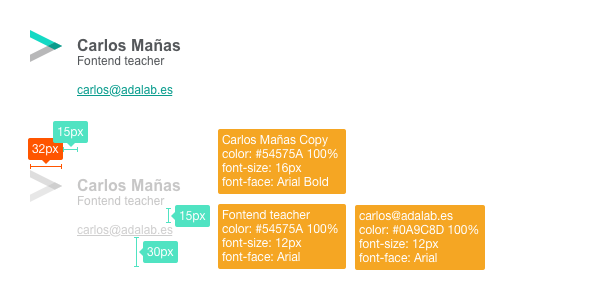

# E1: Firma de email
En nuestro nuevo trabajo nos han pedido que hagamos la firma de email de la empresa como ejercicio de bienvenida.

La firma consta de los siguientes elementos:
1. Logo de la empresa
2. Nombre y primer apellido del empleado
3. Cargo que ocupa
4. Dirección de email

## Guía del ejercicio
En la siguiente imagen tenéis el aspecto que debe tener la firma y una versión con los tamaños y datos necesarios para maquetar el ejercicio.  

## Retos
### 1. Las tablas
Recordad que, por ahora, todo lo que vaya a email se tiene que maquetar con tablas, tendréis que aprender a usarlas como se hacía hace 15 años ;)

### 2. Los estilos
Nada de archivos css, los estilos van en el atributo `style` del elemento HTML que toque. Tendréis que luchar contra la herencia como no lo habéis hecho antes ;)  
>	Ah, y nada de hovers o mediaqueries

### 3. Imágenes "retina"
Como sabréis, cada vez hay más dispositivos con pantallas de alta densidad de píxels. Las famosas pantallas "retina" de los dispositivos Apple no son las mejores (dan de 2x a 3x) pero son las que os van a pedir.
En la carpeta **assets/img/** tenéis el logo a 3x, es decir, a 32px x 3 = 96px.
Tendréis que investigar cómo usarlo ;)
