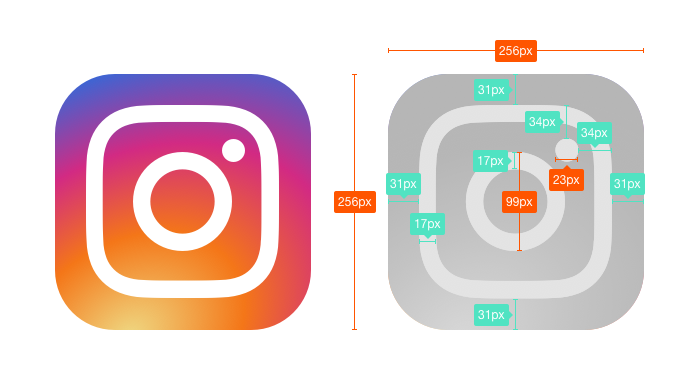

# E2: Icono de Instagram en CSS
En la planta tres, cubículo 14-1-59, hay un diseñador que siempre va fardando de lo bien que maqueta, pero parece que el icono de Instagram se le resiste en HTML/CSS. Es hora de subirse las mangas y marcar una línea en la arena. Lo haremos nosotras!

## Guía del ejercicio
En la siguiente imagen tenéis el resultado final y una pequeña guía para replicarlo en HTML/CSS.



El degradado real es un poco más complicado y usaremos este que nos vale para el ejemplo:
```css
background: radial-gradient(28% 23%, #EFD882 19%, #F47618 49%, #D22A83 75%, #3F64D2 100%);
```

## Retos
### 1. El html
Podemos resolver el ejercicio con este html:
```html
<div class="instagram">
	<div class="instagram__camera">
		<div class="instagram__view"></div>
		<div class="instagram__lens"></div>
	</div>
</div>
```

Pero si nos venimos arriba y queremos molar mucho podemos usar este otro:
```html
<div class="instagram">
	<div class="instagram__camera"></div>
</div>
```

### 2. Tamaños
¿Seremos capaces de hacerlo de manera que cambiando el tamaño de fuente de nuesto contenedor `.instagram` aumente o disminuya el icono proporcionalmente?
