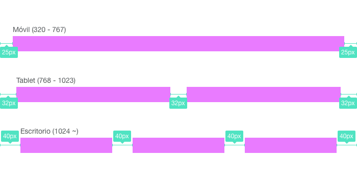

# E3: Una historia de grids
Parece que en nuestro nuevo departamento de front hay un club secreto y nos ha llegado un mail misterioso con las prueba de acceso: vamos a crear un pequeño sistema de grid con herramientas nuevas y antiguas :) Tendremos que resolverlo con **CSS Grid**, con **Flexbox**, y si nos vemos con fuerza, con **display: inline-block**! ¿Seremos capaces?

Nos entregan un html preparado con un css básico que tendremos que rellenar bajo los comentarios que nos han dejado:
```css
/* A Partir de aquí empieza tu código *
/* Añadir solución de CSSGrid */


/* Añadir solución de Flexbox */


/* Añadir solución con display:inline-block */

```

Tendremos que solucionar nuestro sistema de grid con tres breakpoints:
* 320px - 767px
* 768px - 1023px
* 1024px ~

## Guía del ejercicio
En la siguiente imagen tenéis el resultado final y una pequeña guía para solucionar la prueba.




## Retos
### 1. Márgenes exteriores
Los márgenes exteriores los da el elemento `.wrapper`, tendremos que asegurarnos que nuestras columnas ocupan todo el ancho disponible sin salirse o quedarse cortos. El elemento `.wrapper` tiene unas líneas discontinuas para que siempre sepamos de dónde a dónde deben llegar nuestras columnas.

### 2. Breakpoints
¿Seremos capaces de mantener el número de columnas para cada breakpoint? Hay unos módulos de contenido preparados para que siempre veamos lo que ocupan nuestras columnas

### 3. Márgenes interiores
Conforme avanzan las pruebas veremos que mantener el espaciado entre elementos nos es tan fácil... ¿usaremos selectores avanzados? ¿Margins? ¿Paddings? ¿o todo junto?

### 4. Maquetación prehistórica
¿Seremos capaces de, sin usar floats, resolver la última parte donde hay que hacer la misma estructura pero solo usando display: inline-block??
